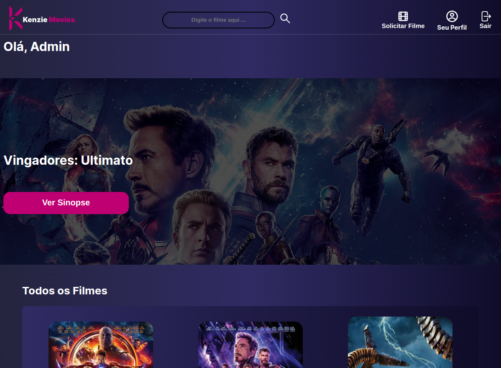
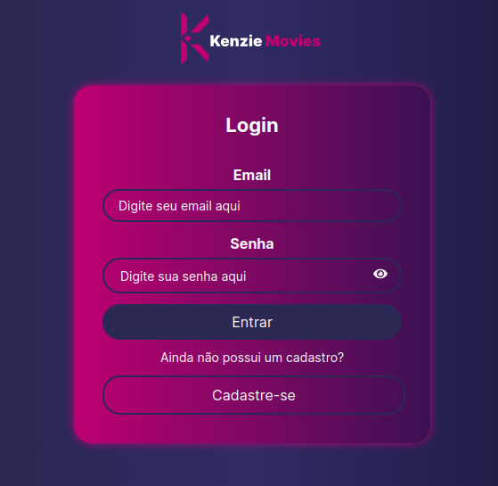
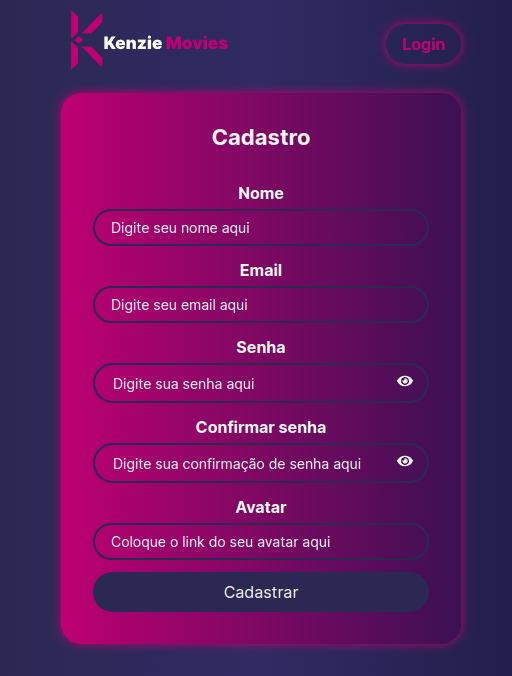

 

<!-- <h1 align="center"> Projeto final M3 </h1>  -->
    
 Este é o projeto final - M3 da aplicação **Kenzie movies** - O objetivo dessa aplicação é proporcionar aos amantes de filmes uma experiência agradável na
 hora de escolher e favoritar seus filmes preferidos.
<!--     -->
   
   ##  📁 Acesso ao projeto
   
 Para acessar o projeto basta [clicar aqui](https://www.google.com/).

## :hammer: Funcionalidades
Esta é uma plataforma interativa onde os usuários podem favoritar os filmes já existentes no site para acompanhá-los posteriormente e  também podem solicitar o cadastro de um novo filme, sendo aprovado ou rejeitado pelos administradores.

administradores podem gerenciar solicitações de cadastro de novos filmes, bem como favoritá-los para futuras referências.

 A aplicação posssui ainda página de cadastro e login.
 
    
 
 

  
 ## Autores
 
| [ Isabel Paiva](https://github.com/isabelpaiva) |  [ Daniel Mello](https://github.com/DMCFaria) | [ Roger Magalhães](https://github.com/Rogermferr) | [ Onésimo brito](https://github.com/briito)
| :---: | :---: | :---: |  :---: |
